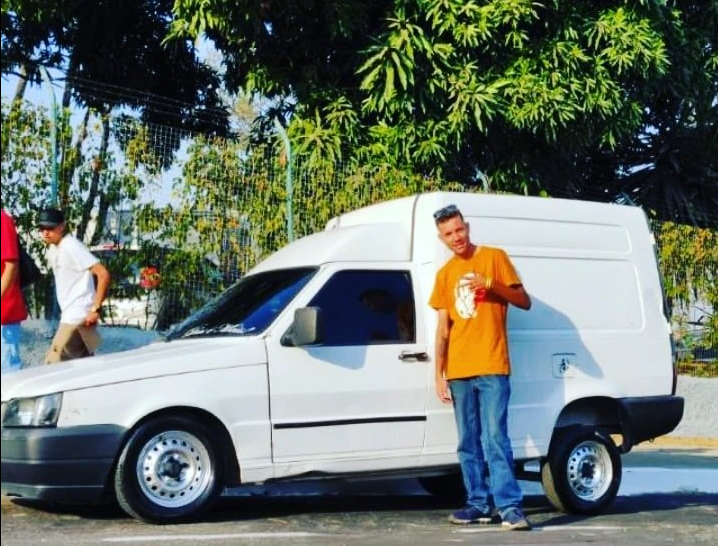
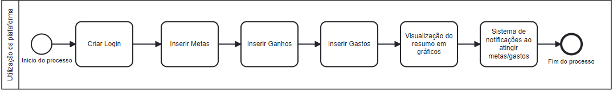
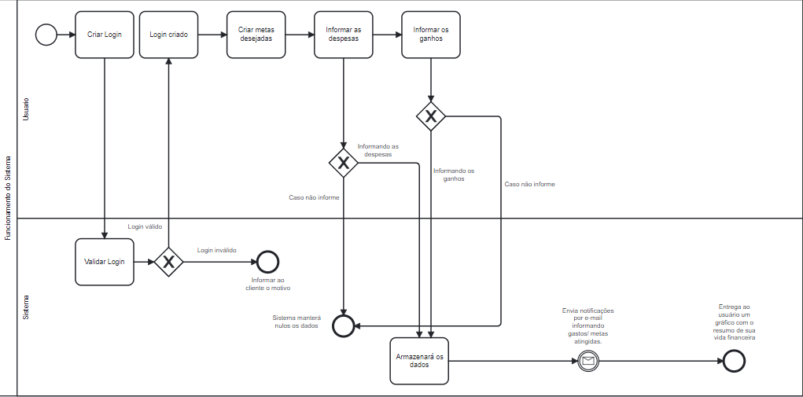
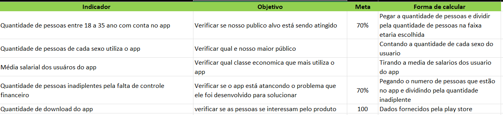
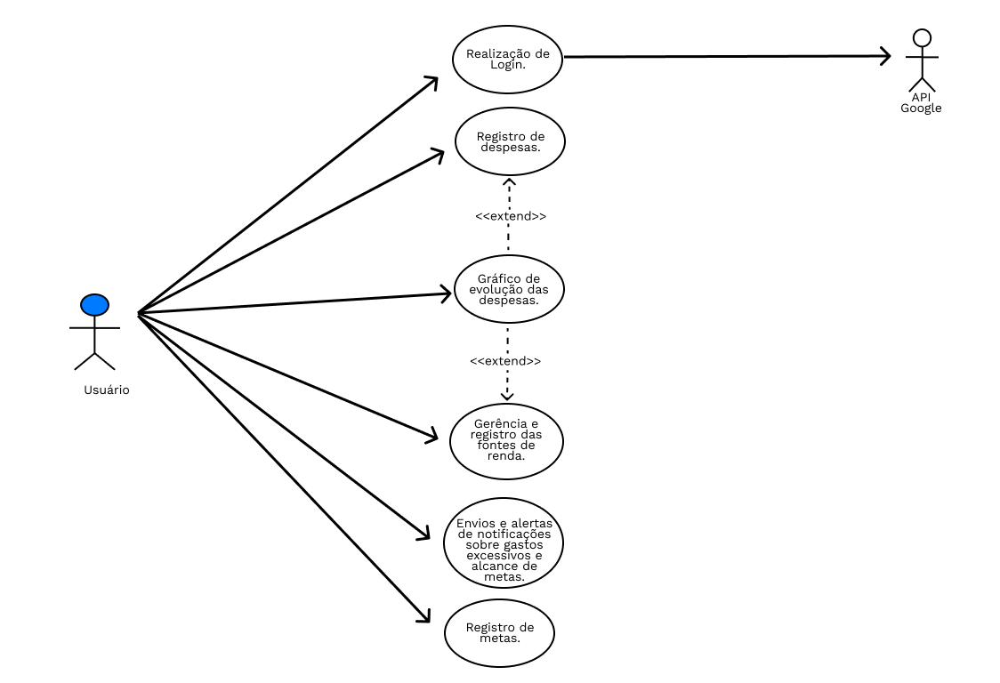
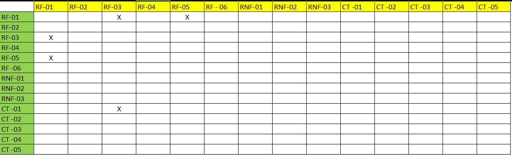

# Especificações do Projeto

## Personas

AS personas são personagens fictícios criados para representar perfis de clientes ou usuários de determinado produto ou serviço. O objetivo é ter uma compreensão mais profunda das necessidades, desejos e comportamentos desses usuários, para que os desenvolvedores do My Finances possam criar o software que atendam às suas expectativas.

A criação de personas ajuda a equipe de desenvolvimento a entender as necessidades e desejos dos diferentes tipos de usuários e a projetar uma experiência mais personalizada e eficaz para eles.

A seguir temos as personas com os perfis criados com os diferentes tipos de usuários que o My Finances possa ter. Algumas das características comuns que foram incluídas nas personas foram nome, idade, gênero, nível de educação, recebimento salarial mensal, nível de gastos com cartões de créditos, interesses e objetivos.

`PERSONA 1`

> - Nome: Letícia Ofélia 
> - Idade: 20 anos 
> - Profissão: Desenvolvedora de software. 
> - Uso do cartão de crédito: Regular, gasto de 1 a 3 salários-mínimos. 
> - Salário: 1 a 3 salários-mínimos. 
> - Usa cartão de crédito: sim. 
> - O que acha sobre uma aplicação financeira que ajuda a controlar os gastos: Uma ótima e necessária ideia.
 
`PERSONA 2`

> - Nome: Albert Fiorini
> - Idade: 30 anos 
> - Profissão: Drifiteiro 
> - Uso do cartão de crédito: Regular, gasto de 1 a 3 salários-mínimos. 
> - Salário: menos que 1 salários-mínimos. 
> - Usa cartão de crédito: sim. 
> - O que acha sobre uma aplicação financeira que ajuda a controlar os gastos: Não tenho muito conhecimento, mas gostaria de saber mais sobre. 

 
`PERSONA 3`

> - Nome: Andrew Wiggins
> - Idade:25 
> - Profissão: Bancário 
> - Uso do cartão de crédito: Regular, gasto de 1 a 3 salários-mínimos. 
> - Salário: 3 a 5 salários-mínimos. 
> - Usa cartão de crédito: sim. 
> - O que acha sobre uma aplicação financeira que ajuda a controlar os gastos: Acredito que seja algo extremamente necessário.

## Historias de Usuários

Com base na análise das personas forma identificadas as seguintes histórias de usuários:

|EU COMO... `PERSONA`| QUERO/PRECISO ... `FUNCIONALIDADE`                                      |PARA ... `MOTIVO/VALOR`                                                        |
|--------------------|-------------------------------------------------------------------------|-------------------------------------------------------------------------------|
|Letícia             | Controlar meus gastos.                                                  | Para ter maior controle sobre meu dinheiro.                                   |
|Andrew              | Acompanhar a evolução dos meus gastos.                                  | Para saber se estou gastando muito ou pouco mensalmente.                       |
|Andrew              | Controlar a renda que entra todos os meses.                             | Para planejar meus gastos de uma forma mais previsível.                       | 
|Albert              | Acompanhar a quantidade de dinheiro que consegui juntar.                | Para saber se estou próximo de alcançar meu objetivo.                         |

## Modelagem do Processo de Negócio 

### Análise da Situação Atual

Atualmente, apps de instituições bancárias e outros sistemas financeiros não têm, ou não potencializam o uso de seu sistema para facilitar ao usuário a visualização sucinta de sua vida financeira para que o mesmo possa controlar suas finanças. 

Para ilustrar, a seguir segue um diagrama referenciado no My Finances de como deverá funcionar de forma simplista os processos de visualização de finanças no sistema.

### Descrição Geral da Proposta

A concepção da modelagem dos processos de negócio neste projeto tem como principal alvo demonstrar de forma objetiva a função de cada requisito, deixando-os o mais claro possível para a organização. Facilitando a rotina para o desenvolvimento da aplicação.

### Processo 01 - Funcionamento do Sistema

Abaixo demonstra-se o diagrama BPMN de como deverá funcionar o sistema de acordo com os seus requisitos. 

## Indicadores de Desempenho

Obs.: todas as informações para gerar os indicadores devem estar no diagrama de classe a ser apresentado a posteriori. 

## Requisitos

As tabelas que se seguem apresentam os requisitos funcionais e não funcionais que detalham o escopo do projeto. Para determinar a prioridade de requisitos, aplicar uma técnica de priorização de requisitos e detalhar como a técnica foi aplicada.

### Requisitos Funcionais

|ID    | Descrição do Requisito  | Prioridade |
|------|-----------------------------------------|----|
|RF-001| Permitir que o usuário cadastre tarefas | ALTA | 
|RF-002| Emitir um relatório de tarefas no mês   | MÉDIA |

### Requisitos não Funcionais

|ID     | Descrição do Requisito  |Prioridade |
|-------|-------------------------|----|
|RNF-001| O sistema deve ser responsivo para rodar em um dispositivos móvel | MÉDIA | 
|RNF-002| Deve processar requisições do usuário em no máximo 3s |  BAIXA | 

Com base nas Histórias de Usuário, enumere os requisitos da sua solução. Classifique esses requisitos em dois grupos:

- [Requisitos Funcionais
 (RF)](https://pt.wikipedia.org/wiki/Requisito_funcional):
 correspondem a uma funcionalidade que deve estar presente na
  plataforma (ex: cadastro de usuário).
- [Requisitos Não Funcionais
  (RNF)](https://pt.wikipedia.org/wiki/Requisito_n%C3%A3o_funcional):
  correspondem a uma característica técnica, seja de usabilidade,
  desempenho, confiabilidade, segurança ou outro (ex: suporte a
  dispositivos iOS e Android).
Lembre-se que cada requisito deve corresponder à uma e somente uma
característica alvo da sua solução. Além disso, certifique-se de que
todos os aspectos capturados nas Histórias de Usuário foram cobertos.

## Mapeamento dos Requisitos

Com o mapeamento dos processos organizacionais demonstrado anteriormente no Diagrama BPMN, podem ser feitas as seguintes relações quanto aos requisitos funcionais e não-funcionais elicitados e os processos mapeados: 

| REQUISITOS FUNCIONAIS | PROCESSOS | TIPO DE USUÁRIO |
|---|:---:|:---:|
|RF- 01: O sistema deve possibilitar o usuário a criar metas para poupar dinheiro.  | - Fazer Login;  - Ir para Aba de criar metas. | Usuário |
| RF-02: O sistema deve possibilitar o usuário a criar um Login para ter acesso as suas informações de maneira privada.  |  - Criar uma conta utilizando seus dados pessoais. | Usuário |
| RF-03: O sistema deve permitir que o usuário registre todas as suas despesas para que o mesmo tenha um maior controle sobre seus gastos. | - Fazer login;  -Informar despesas. | Usuário |
| RF-04: O sistema deve disponibilizar um gráfico que mostre a evolução das despesas do usuário mês a mês, para que o mesmo veja se está conseguindo alcançar seus objetivos. | - Fazer login;  - Informar despesas;  - Informar ganhos. | Usuário |
| RF-05: O sistema deve possibilitar ao usuário registrar todas suas fontes de renda, para que o mesmo consiga gerenciar de onde está vindo o seu dinheiro. |  - Fazer login;  - Informar ganhos. | Usuário |
| RF-06: O sistema enviará notificações ao usuário alertando sobre gastos excessivos ou alcance de metas. | - Estar conectado ao aplicativo. | Servidor |

| REQUISITOS NÃO-FUNCIONAIS | PROCESSOS | BPMN |
|:---:|:---:|:---:|
| RNF-01: Aplicações deve ser compatível com os principais sistemas mobile. | - Todos | Ambas |
| RNF-02: Site terá um layout minimalista.   | - Todos | Cliente |
| RNF-03: Sistema deve ser organizado e de fácil visibilidade e ter uma interface dinâmica.  | - Todos | Cleinte |

## Restrições

O projeto está restrito pelos itens apresentados na tabela a seguir.

|ID| Restrição                                             |
|--|-------------------------------------------------------|
|01| O projeto deverá ser entregue até o final do semestre |
|02| Não pode ser desenvolvido um módulo de backend        |

Enumere as restrições à sua solução. Lembre-se de que as restrições geralmente limitam a solução candidata.

> **Links Úteis**:
> - [O que são Requisitos Funcionais e Requisitos Não Funcionais?](https://codificar.com.br/requisitos-funcionais-nao-funcionais/)
> - [O que são requisitos funcionais e requisitos não funcionais?](https://analisederequisitos.com.br/requisitos-funcionais-e-requisitos-nao-funcionais-o-que-sao/)

## Diagrama de Casos de Uso

O UML (Unified Modeling Language) é uma linguagem de notação (um jeito de escrever, ilustrar, comunicar) para uso em projetos de sistemas. O objetivo do diagrama de caso de uso o UML é demonstrar as diferentes maneiras que o usuário pode interagir com um sistema.

# Matriz de Rastreabilidade

A matriz de rastreabilidade é uma ferramenta usada para facilitar a visualização dos relacionamento entre requisitos e outros artefatos ou objetos, permitindo a rastreabilidade entre os requisitos e os objetivos de negócio. 

Após analisar os requisitos do sistema, criamos a seguinte matriz de rastreabilidade facilitar a identificação nas relações dos requisitos

# Gerenciamento de Projeto

De acordo com o PMBoK v6 as dez áreas que constituem os pilares para gerenciar projetos, e que caracterizam a multidisciplinaridade envolvida, são: Integração, Escopo, Cronograma (Tempo), Custos, Qualidade, Recursos, Comunicações, Riscos, Aquisições, Partes Interessadas. Para desenvolver projetos um profissional deve se preocupar em gerenciar todas essas dez áreas. Elas se complementam e se relacionam, de tal forma que não se deve apenas examinar uma área de forma estanque. É preciso considerar, por exemplo, que as áreas de Escopo, Cronograma e Custos estão muito relacionadas. Assim, se eu amplio o escopo de um projeto eu posso afetar seu cronograma e seus custos.

## Gerenciamento de Tempo

Com diagramas bem organizados que permitem gerenciar o tempo nos projetos, o gerente de projetos agenda e coordena tarefas dentro de um projeto para estimar o tempo necessário de conclusão.

O gráfico de Gantt ou diagrama de Gantt também é uma ferramenta visual utilizada para controlar e gerenciar o cronograma de atividades de um projeto. Com ele, é possível listar tudo que precisa ser feito para colocar o projeto em prática, dividir em atividades e estimar o tempo necessário para executá-las.

## Gerenciamento de Equipe

O gerenciamento adequado de tarefas contribuirá para que o projeto alcance altos níveis de produtividade. Por isso, é fundamental que ocorra a gestão de tarefas e de pessoas, de modo que os times envolvidos no projeto possam ser facilmente gerenciados. 

## Gestão de Orçamento

O processo de determinar o orçamento do projeto é uma tarefa que depende, além dos produtos (saídas) dos processos anteriores do gerenciamento de custos, também de produtos oferecidos por outros processos de gerenciamento, como o escopo e o tempo.

