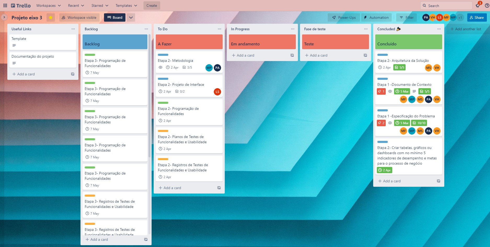

# Metodologia

Pré-requisitos: <a href="2-Especificação do Projeto.md"> Documentação de Especificação</a>

Descreva aqui a metodologia de trabalho do grupo para atacar o problema. Definições sobre os ambiente de trabalho utilizados pela  equipe para desenvolver o projeto. Abrange a relação de ambientes utilizados, a estrutura para gestão do código fonte, além da definição do processo e ferramenta através dos quais a equipe se organiza (Gestão de Times).

## Relação de Ambientes de Trabalho

Para que tenhamos uma boa produtividade no desenvolvimento do nosso software iremos usar as seguintes ferramentas:
|Ambiente                        | Plataforma            |Link de Acesso                                           |
|--------------------------------|-----------------------|-------------------------------------------------------------------------------------------------------------------------------------------------------------------------------------------------------|
|Documentos do Projeto           |One Drive              | https://sgapucminasbr-my.sharepoint.com/:w:/r/personal/1348060_sga_pucminas_br/_layouts/15/Doc.aspx?sourcedoc=%7B8A7122F0-07A5-4299-B679-9A09154F41A9%7D&file=MY%20FINANCES%20.docx&action=default&mobileredirect=true |
|Repositório de Código Fonte      |Git Hub                | https://github.com/ICEI-PUC-Minas-PMV-ADS/pmv-ads-2023-1-e3-proj-mov-t6-grupo-5-my-finace |
|Projeto de Interface e wireframes |Figma                  | |
|Gerenciamento de Projeto          |Trello             | https://trello.com/b/TCtybrpI/projeto-eixo-3  |

## Controle de Versão
O controle de versão é importante para que haja uma organização de atualizações e mudanças que estão sendo feitas pela equipe no projeto. 

A ferramenta de controle de versão adotada no projeto foi o Git, sendo que o Github foi utilizado para hospedagem do repositório. 

O projeto segue a seguinte convenção para o nome de branches: 

- `main`: versão estável já testada do software. 

- `unstable`: versão já testada do software, porém instável. 

- `testing`: versão em testes do software. 

- `dev`: versão de desenvolvimento do software. 

Quanto à gerência de issues, o projeto adota a seguinte convenção para etiquetas: 

- `documentation`: melhorias ou acréscimos à documentação. 

- `bug`: uma funcionalidade encontra-se com problemas. 

- `enhancement`: uma funcionalidade precisa ser melhorada. 

- `feature`: uma nova funcionalidade precisa ser introduzida. 

## Gerenciamento de Projeto

Para gerenciamento do projeto utilizaremos a metodologia ágil scrum. 

### Divisão de Papéis

- Luis Othávio Santos da Silva - Desenvolvedor

- Matheus Ferreira Pires – Desenvolvedor  

- Matheus Lemos Sampaio – Design e Desenvolvedor 

- Pedro Assis Silva de Almeida - Product Owner e Desenvolvedor 

- Vitor Hugo Silva Ribeiro- Scrum Master e Desenvolvedor  

Para organização e distribuição de tarefas do projeto, utilizaremos o Trello estruturado da seguinte forma: 

- `Backlog`: Nessa parte fica todas as tarefas que vão ser desenvolvidas no projeto. Caso apareça alguma nova e direcionada nessa parte. 

- `A Fazer (Sprint Backlog)`: E a sprint atual que estamos trabalhando. 

- `Em Andamento`: Quando a tarefas foi iniciada. 

- `Concluido`: Quando a tarefa for finalizada.

O quadro kanban do grupo no Trello disponível em: https://trello.com/b/TCtybrpI/projeto-eixo-3, na imagem abaixo mostra como ele está.

### Processo

Para a gerenciar os processos e automatizar os fluxos de tarefas do projeto, o time My Finances utiliza-se o work board ou work space, ferramenta visual do Trello, com estrutura simples, flexível e poderosa para o desenvolvimento com os seguintes status:

- **Documentation:** sequência das tarefas referentes à documentação de contexto que serão trabalhadas pela equipe, conforme cronograma do curso de Análise Desenvolvimento de Sistemas da Pontifícia Universidade Católica de Minas Gerais (PUC Minas).

- **Useful Links:** Nesse cartão tem os links dos templetes de consulta para auxilio do processo do projeto.

- **Backlog:** Nessa coluna, encontra-se todas as pendências das etapas da entrega a ser processadas. 

- **To Do:** Nessa coluna, estão alocadas as tarefas estabelecidas para a Sprint atual e que ainda não foram iniciadas, assim como os membros da equipe responsáveis por cada item.

- **In Progress:** Tarefas que já foram iniciadas mas ainda não finalizadas, são acompanhadas rotineiramente seguindo os ritos da metodologia ágil.

- **Test Phase:** Tarefas iniciadas e finalizadas. Etapa de extrema importância no processo de desenvolvimento de software, visam validar se a aplicação está funcionando corretamente e se atende aos requisitos especificados.

- **Concluded:** Tarefas concluídas e aprovadas no teste de qualidade.

O quadro kanban de processos encontra-se no Trello disponível em: https://trello.com/b/TCtybrpI/projeto-eixo-3, a seguir temos a imagem para visualização:

### Ferramentas

A seguir temos as ferramentas empregadas no projeto: 

- **Editor de Código:** O editor de código escolhido foi o _Visual Studio_ pela integração com outras ferramentas utilizadas no projeto como _GitHub_ e o _SQL Server_.
- **Ferramentas de comunicação:** A ferramenta de comunicação escolhida foi o _Microsoft Teams_ e _Discord_ devido a facilidade de comunicação, reuniões em vídeo, compartilhamento de arquivos e a criação de um ambiente de trabalho exclusivamente focado no nosso projeto.
- **Ferramentas de desenho de tela (wireframing):** A ferramenta escolhida para a elaboração dos wireframes foi o _Figma_. A escolha se deu dado a sua capacidade de geração de wireframes interativos detalhados.
- **Ferramentas de elaboração de diagramas:** Para a elaboração dos diversos diagramas do projeto (diagramas de fluxo, diagramas de classes, modelo ER e esquema relacional), a ferramenta _Figma_ foi escolhida por conta de sua versatilidade para elaboração de diagramas de diversos tipos.
- **Ferramentas de controle de versão:** A ferramenta de controle de versão escolhida foi o _Git_, cuja utilização se deu através da integração com o editor de código _Visual Studio_, para a hospedagem do repositório será utilizado o _GitHub_. Essa escolha foi feita devido à robustez dessas ferramentas e a familiaridade dos membros da equipe com as elas.
- **Ferramenta de gerenciamento de projeto:** A ferramenta _Github_ foi escolhida para a organização e distribuição das tarefas seguindo o modelo Scrum, conforme descrito na subseção “Processo”. A ferramenta foi escolhida dada sua facilidade de uso e sua compatibilidade com a metodologia Scrum, com diversos materiais disponíveis sobre sua integração com esta.
   
