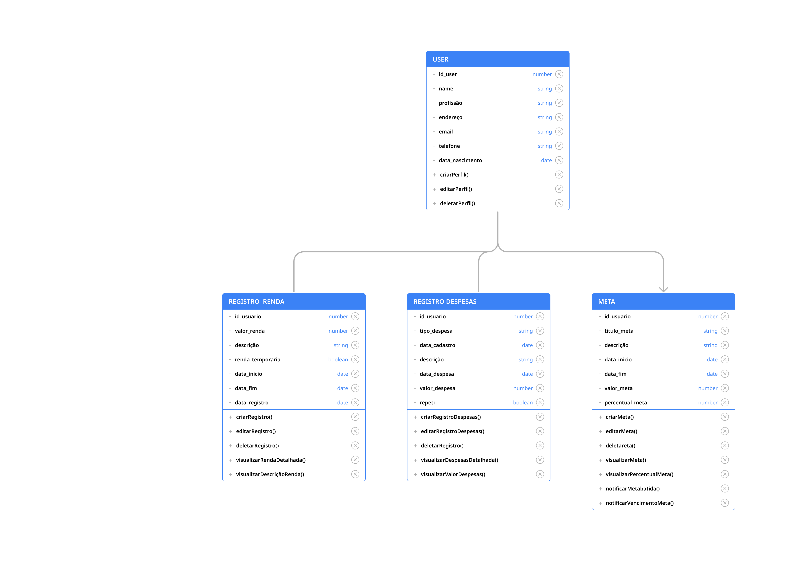
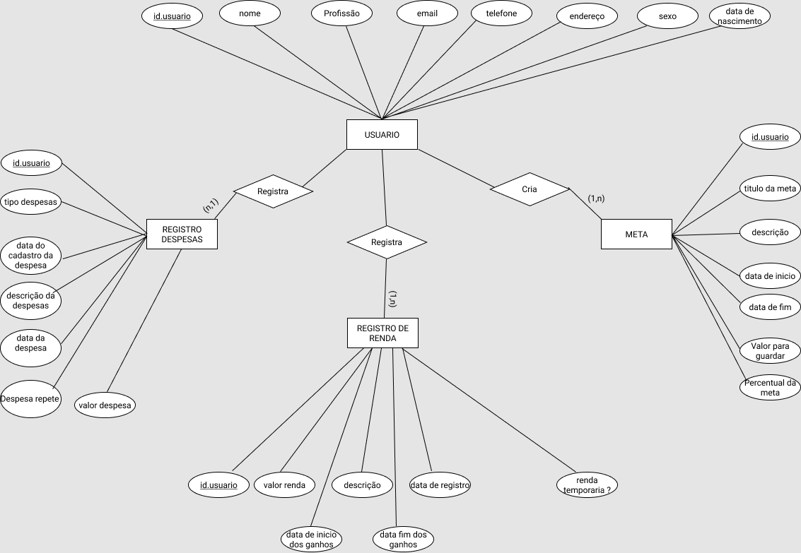
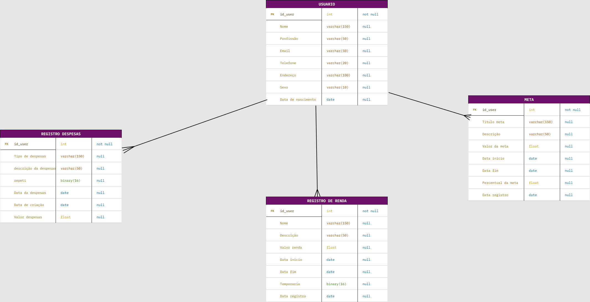
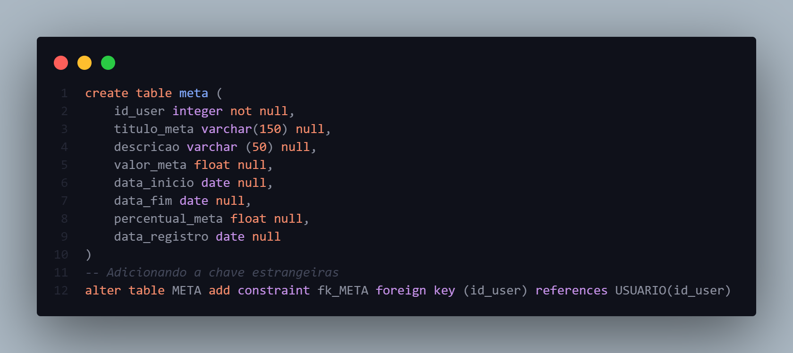
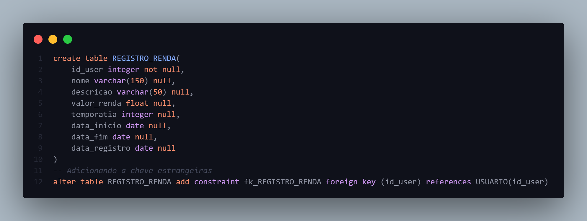
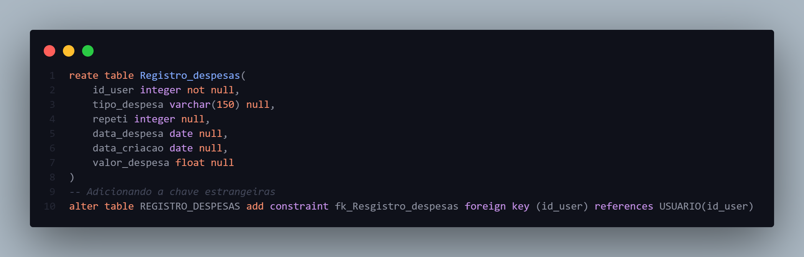

# Arquitetura da Solução

Pré-requisitos: <a href="3-Projeto de Interface.md"> Projeto de Interface</a>

Definição de como o software é estruturado em termos dos componentes que fazem parte da solução e do ambiente de hospedagem da aplicação.

## Diagrama de Classes

## Modelo ER

## Esquema Relacional

## Modelo Físico

Entregar um arquivo banco.sql contendo os scripts de criação das tabelas do banco de dados. Este arquivo deverá ser incluído dentro da pasta src\bd.
Além do arquivo fisico do BD, colocamos algumas imagens da representação dele

## Tecnologias Utilizadas

|Tecnologias|Utilização|
|:---:|:---:|
|JavaScript|Desenvolvimento da Aplicação|
|React Native|Framework de desenvolvimento|
|MySQL|Banco de dados|
|VS Code|Ferramenta de codificação|
|Figma|Prototipagem da Aplicação|

## Hospedagem

Explique como a hospedagem e o lançamento da plataforma foi feita.

> **Links Úteis**:
>
> - [Website com GitHub Pages](https://pages.github.com/)
> - [Programação colaborativa com Repl.it](https://repl.it/)
> - [Getting Started with Heroku](https://devcenter.heroku.com/start)
> - [Publicando Seu Site No Heroku](http://pythonclub.com.br/publicando-seu-hello-world-no-heroku.html)

## Qualidade de Software

Utilizaremos com base na norma de qualidade de produto de software ISO/IEC 9126. Assim levantamos 6 características com 2 subcaracterísticas cada:

1. **Funcionalidade**

* **Adequação:** Será analisado se o software atende a demanda para qual foi proposto. Foi escolhida essa sub-característica devido estar focada em atender pessoas que não tem o hábito de poupar seus ganhos ou não terem controle de quanto está restando de sua renda no final do mês.
 
* **Segurança:** Manter os dados protegidos é uma das principais preocupações quando se fala em aplicação mobile, sendo assim, esse tópico irá avaliar a segurança da senha de acesso e os dados inseridos pelo usuário.

2. **Confiabilidade:**

* **Tolerância a falhas:** Se tratando de uma aplicação que exige a inserção de dados do usuário manualmente, pode-se estar sujeita a falhas como perda dos dados em sua inclusão. A tolerância deve ser avaliada de modo que o usuário não perca informações essenciais. 

* **Recuperabilidade:** Relacionado ao tópico anterior, será avaliado a recuperação de dados em eventos de falhas.

3. **Usabilidade**

* **Inteligibilidade:** Um software é voltado para o usuário e de nada vale um software que não cumpre suas funcionalidades e que possui um visual confuso. Pensando nisso, criaremos uma interface com o propósito de fácil visibildiade e intuitiva. 
 
* **Apreensibilidade:** Nesse tópico será avaliada a dificuldade para realização de determinadas tarefas dentro do aplicativo.

4. **Eficiência**

* **Comportamento em relação ao tempo:** Em um aplicativo mobile é evidente que o usuário espera agilidade na apresentação das informações em sua tela, com isto, iremos aprimorar o desempenho da aplicação. 

* **Utilização de Recursos:** Com relação com o tópico anterior, será analisada a entrega de dados para garantir um tempo aceitável nas apresentações das informações ao usuário, sem necessitar de um grande uso de sua memória.

5. **Manutenabilidade**

* **Analisabilidade:** Pensando numa maior facilidade para a equipe de desenvolvimento, será analisado o código e averiguado a dificuldade ou facilidade na identificação de problemas que precisam ser resolvidos. 

* **Modificabilidade:** Analisar a documentação e a identação de códigos, assim os desenvolvedores teram uma maior facilidade para identificar as funções de cada parte do código.

6. **Portabilidade:**	 

* **Capacidade de instalação:** Nesse tópico será feito a avaliação das possíveis dificuldades enfrentadas para a instalação do aplicativo. 

* **Coexistência:** Será avaliado se há conflitos com os sistemas operacionais móbile.
