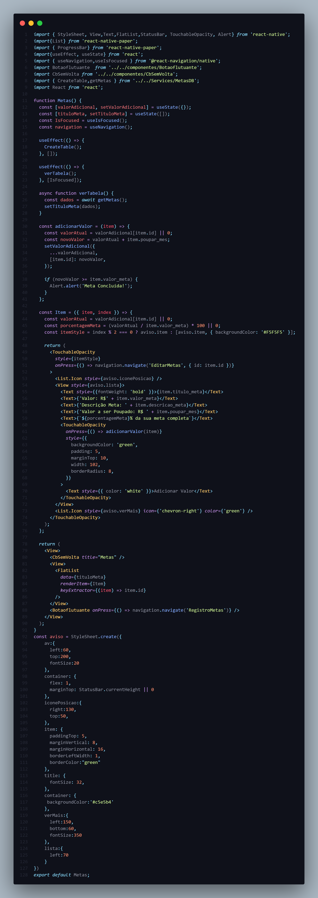

# Programação de Funcionalidades

Para a entrega da segunda etapa implementamos a tela de registro de despesas como podemos ver nas imagens a seguir

## Códificação da tela de Login

## Tela Login Finalizada

## Códificação da tela de Cadastro

## Tela de Cadastro Finalizada

## Códificação da tela de Despesas

## Tela finalizada

## Codificação Tela de Registro de Rendas

## Tela Registro de Rendas Finalizada

## Codificação Tela de Visualização de Rendas

## Tela Visualização de Rendas Finalizada

## Codificação Tela de Detalhes de Rendas

## Tela de Detalhes de Rendas Finalizada

## Codificação Tela de Edição de Rendas

## Tela de Edição de Rendas Finalizada

## Codificação Tela de acompanhamento das despesas

## Tela de acompanhamento

## Codificação Tela de acompanhamento das despesas

## Tela de acompanhamento
