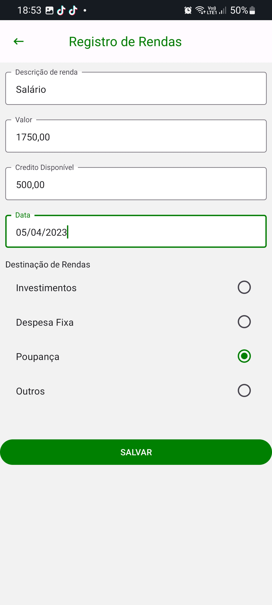

# Registro de Testes de Software

## Caso de teste 01.0 - Realizar o cadastro das despesas

Cadastrando despeas

## Caso de teste 01.2 - Realizar o cadastro das despesas

Informações da despesas selecionada sendo carregadas

## Caso de teste 01.3 - Realizar o cadastro das despesas

Teste de edicição da despesas

## Caso de teste 01.3 - Realizar o cadastro das despesas

Confirmação da exclusão da nota selecionada

## Caso de teste 02.0 - Realizar o cadastro das rendas

Registrando Rendas

## Caso de teste 02.1 - Realizar o cadastro das rendas

Editando Rendas

## Caso de teste 02.2 - Realizar o cadastro das rendas

Excluindo Rendas

