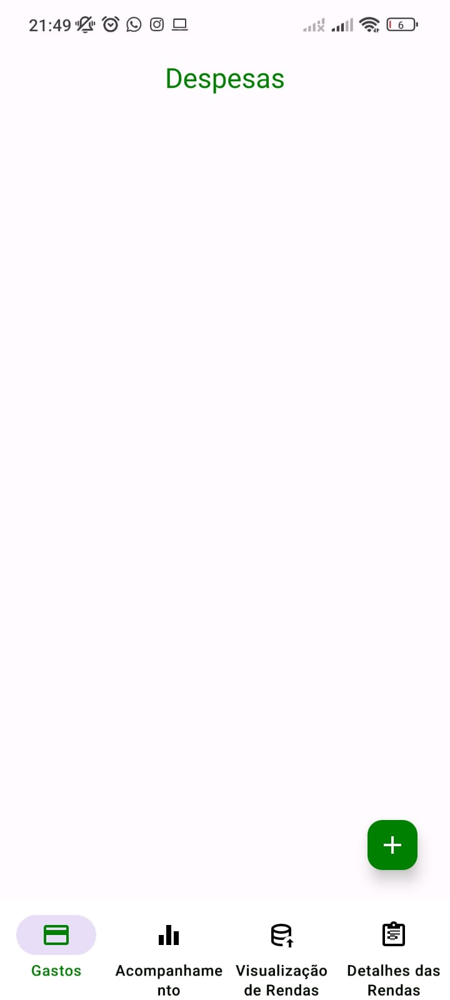
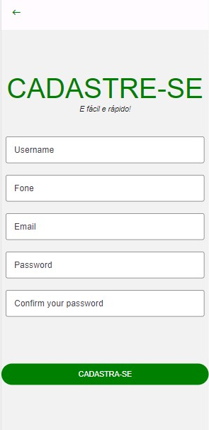
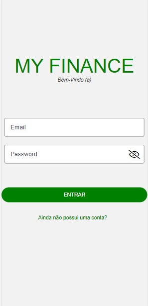

# Registro de Testes de Software

## Caso de teste 01.0 - Realizar o cadastro das despesas

### Cadastrando despeas

## Caso de teste 01.2 - Realizar o cadastro das despesas
### Informações da despesas selecionada sendo carregadas

## Caso de teste 01.3 - Realizar o cadastro das despesas

Teste de edicição da despesas

## Caso de teste 01.3 - Realizar o cadastro das despesas

### Confirmação da exclusão da nota selecionada

## Caso de teste 02.0 - Realizar o cadastro das rendas

### Registrando Rendas

## Caso de teste 02.1 - Realizar o cadastro das rendas

### Editando Rendas

## Caso de teste 02.2 - Realizar o cadastro das rendas

### Excluindo Rendas

## Caso de teste 03.0 - Realizar o cadastro do usuário

## Caso de teste 04.0 - Realizar o Login do do usuário

## Caso de teste 07.0 – Cadastrar Metas

## Caso de teste 07.1 – Cadastrar Metas

## Caso de teste 07.2 – Cadastrar Metas

